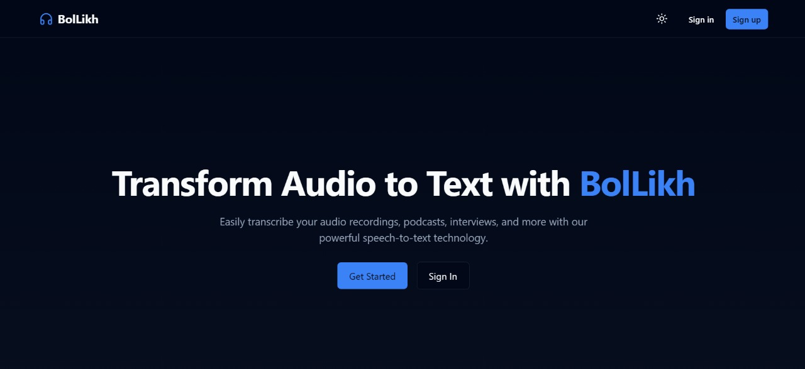
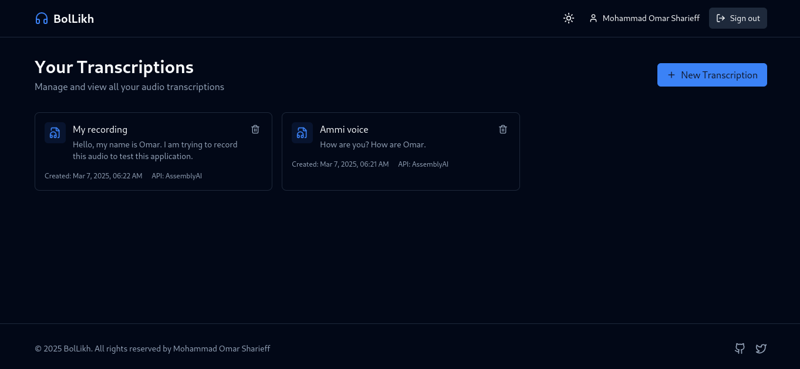
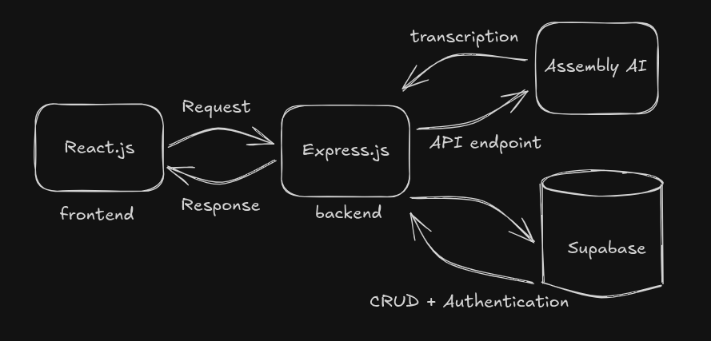
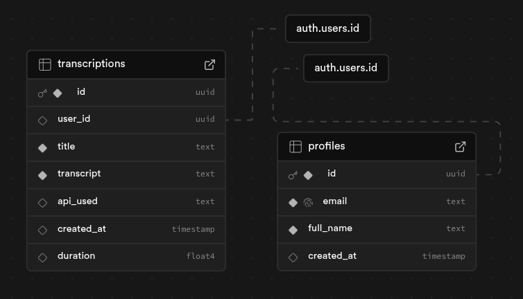

# BolLikh Transcription Web App

BolLikh is a modern, responsive web application for speech-to-text transcription services. It allows users to upload audio files, generate accurate transcriptions using AssemblyAI's powerful API, and manage their transcripts with ease.

## Homepage


## Dashboard


## Transcript Page


## Workflow Diagram


## Database Schema


## Features

- 🔊 **Audio Transcription**: Convert speech to text with high accuracy using AssemblyAI
- 📱 **Responsive Design**: Seamless experience across desktop and mobile devices
- 🌓 **Light & Dark Mode**: Choose your preferred theme for comfortable usage
- 📋 **Transcript Management**: Create, view, and delete your transcriptions
- 💾 **Download Capability**: Export your transcriptions as TXT files
- 🔐 **User Authentication**: Secure account creation and management

## Tech Stack

### Frontend
- **React** (Vite): Fast, modern UI library
- **Zustand**: Lightweight state management
- **Lucide React**: Beautiful, consistent icon set
- **Framer Motion**: Smooth, minimalistic animations
- **Tailwind CSS**: Utility-first CSS framework for styling

### Backend
- **Express.js**: Fast, unopinionated web framework for Node.js
- **Supabase**: Open source Firebase alternative for database and authentication
- **AssemblyAI**: Advanced speech-to-text API integration

## Project Structure

```
bollikh-transcription/
├── client/               # Frontend React application
│   ├── public/           # Static files
│   ├── src/              
│   │   ├── components/   # Reusable UI components
│   │   ├── pages/        # Page components
│   │   ├── store/        # Zustand state management
│   │   └── lib/          # Utility functions and API clients
│   └── ...
│
└── server/               # Backend Express application
    ├── controllers/      # Request handlers
    ├── routes/           # API route definitions
    ├── middleware/       # Express middleware
    ├── services/         # Business logic and external API integration
    └── ...
```

## Getting Started

### Prerequisites
- Node.js (v14 or higher)
- npm or yarn
- Supabase account
- AssemblyAI API key

### Installation

1. Clone the repository
   ```bash
   git clone https://github.com/yourusername/bollikh-transcription.git
   cd bollikh-transcription
   ```

2. Install dependencies for both client and server
   ```bash
   # Install client dependencies
   cd client
   npm install
   
   # Install server dependencies
   cd ../server
   npm install
   ```

3. Set up environment variables
   
   Create a `.env` file in the server directory:
   ```
   PORT=5000
   SUPABASE_URL=your_supabase_url
   SUPABASE_KEY=your_supabase_key
   ASSEMBLY_AI_KEY=your_assembly_ai_key
   ```
   
   Create a `.env` file in the client directory:
   ```
   VITE_API_URL=http://localhost:5000/api
   VITE_SUPABASE_URL=your_supabase_url
   VITE_SUPABASE_PUBLIC_KEY=your_supabase_public_key
   ```

4. Start the development servers

   Server:
   ```bash
   cd server
   npm run dev
   ```
   
   Client:
   ```bash
   cd client
   npm run dev
   ```

5. Open your browser and navigate to `http://localhost:5173`

## Usage

1. Create an account or log in
2. Upload an audio file to transcribe
3. View your transcriptions in the dashboard
4. Download transcriptions as needed
5. Delete transcriptions you no longer need

## Deployment

The application can be deployed to various platforms:

- Frontend: Vercel, Netlify, or GitHub Pages
- Backend: Heroku, Railway, or any Node.js hosting service

## Contributing

Contributions are welcome! Please feel free to submit a Pull Request.

1. Fork the repository
2. Create your feature branch (`git checkout -b feature/amazing-feature`)
3. Commit your changes (`git commit -m 'Add some amazing feature'`)
4. Push to the branch (`git push origin feature/amazing-feature`)
5. Open a Pull Request

## License

This project is licensed under the MIT License - see the LICENSE file for details.

## Acknowledgments

- [AssemblyAI](https://www.assemblyai.com/) for their powerful speech-to-text API
- [Supabase](https://supabase.io/) for database and authentication services
- All open source libraries used in this project